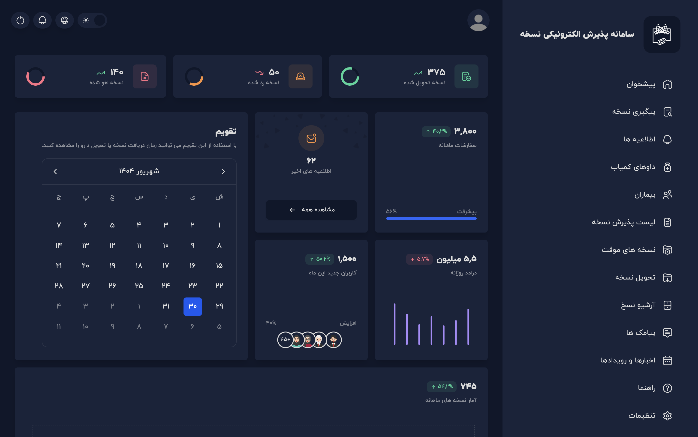
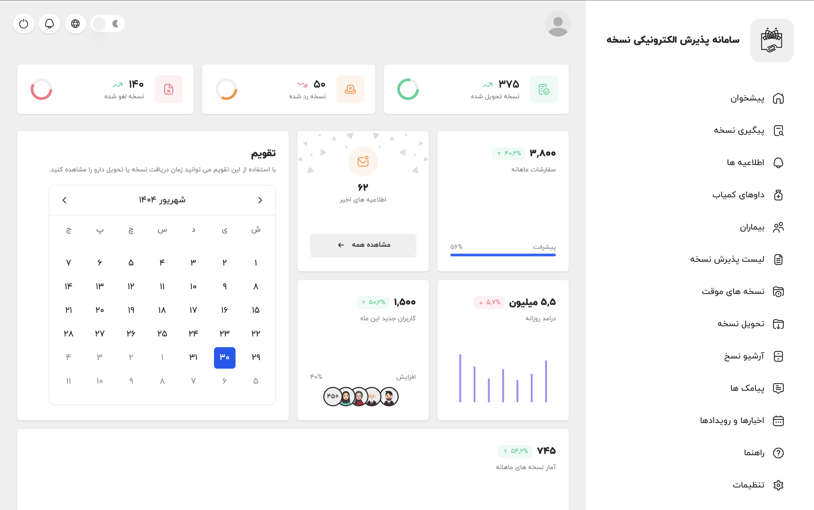
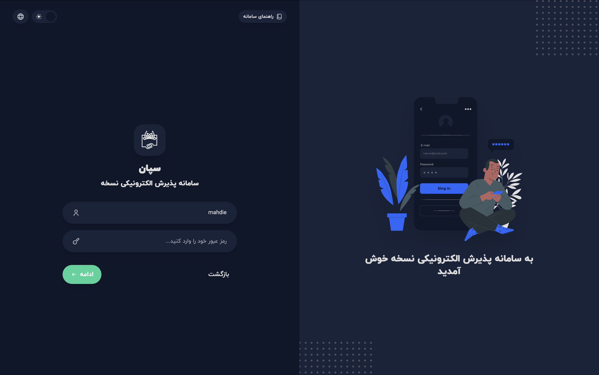

[](https://lunanezha.com/)
[](www.linkedin.com/in/luna-nezha/)

# **Sepan (Pharmacy Platform – React & Ionic)**

# **سپان (سامانه پذیرش الکترونیک نسخه)**

Sepan is a hybrid pharmacy platform built with React and Ionic, designed to improve accessibility and efficiency for patients with critical illnesses. The platform has demonstrated measurable impact in patient enrollment, medication delivery, and overall user satisfaction while maintaining strong performance and maintainability standards.






## **💻 Tech Stack**

- **React**: A JavaScript library for building dynamic and interactive user interfaces.
- **Vite**: Fast build tool for modern web projects.
- **Ionic**: Framework for cross-platform mobile/web apps.
- **TailwindCSS**: A utility-first CSS framework for rapid UI development with minimal custom CSS.
- **TypeScript**: A strongly typed superset of JavaScript, providing static typing for safer and more predictable code.
- **i18next-react**: A powerful internationalization framework for adding multi-language support to your application.

## 🚀 **Run Locally**

Clone the project

```bash
  git clone https://github.com/LunaNezha/sepan-react-ionic
```

Go to the project directory

```bash
  cd sepan-react-ionic
```

Install dependencies

```bash
  npm install
```

Start the server

```bash
  ionic serve
```

Adding Translations

```bash
public/locales/
   en/
      translations.json
   fa/
      translations.json
```

Generate the translations after adding new one

```bash
npm run interface
```

## 🤝 **Contributing**

Contributions are always welcome!

If you’d like to improve this project:

- Fork the repository.
- Create your branch: git checkout -b feature/your-feature.
- Commit your changes: git commit -m "Add your message".
- Push to the branch: git push origin feature/your-feature.
- Open a Pull Request.

## 💡 **Support**

For support, email mahdie.nezhadhosseini@gmail.com.

## 📝 **License**

This project is licensed under the
[MIT](https://choosealicense.com/licenses/mit/) License. See the LICENSE file for details.
